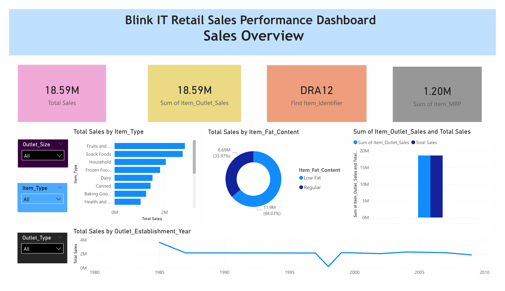
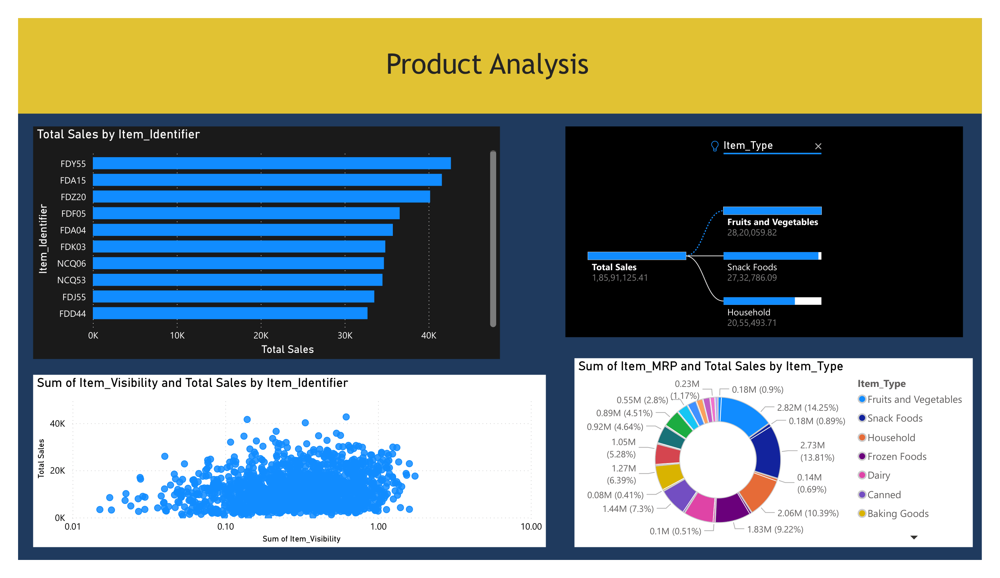
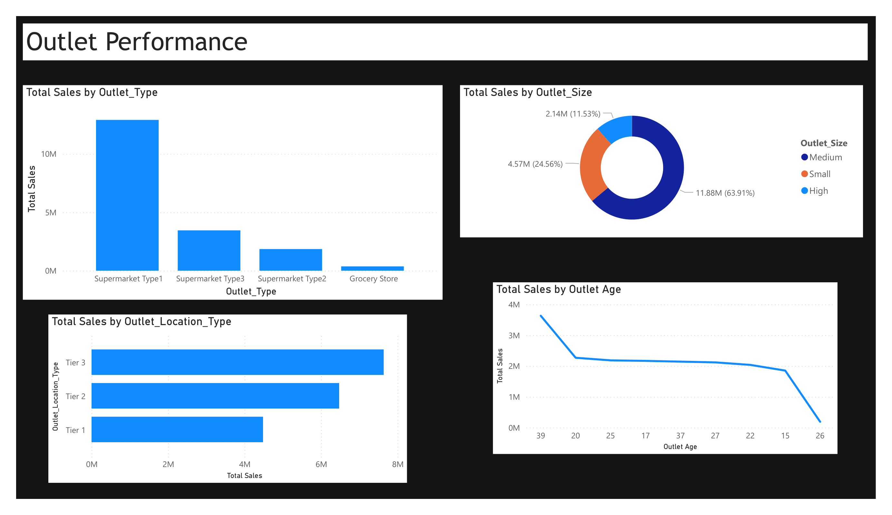

BlinkIT Grocery Sales Analysis Dashboard
Project Overview

This project focuses on analyzing BlinkIT grocery sales data using Power BI. The objective of the project is to transform raw sales data into meaningful insights through interactive dashboards. The analysis helps identify sales trends, product performance, and outlet efficiency to support data-driven business decisions.

Dataset Description

The dataset contains information about grocery product sales across different outlets. It includes product attributes, pricing details, and outlet characteristics. The dataset consists of multiple features such as item type, item visibility, maximum retail price (MRP), outlet size, outlet location type, and item outlet sales.

Tools & Technologies Used

Power BI Desktop

Power Query (Data Cleaning & Transformation)

DAX (Data Analysis Expressions)

Excel Dataset

Data Visualization Techniques

Dashboard Pages
1. Sales Overview

This page provides an overview of overall sales performance including:

Total Sales

Average Sales

Number of Items Sold

Sales by Item Type

Sales by Outlet Location

2. Product Analysis

This page focuses on product-level insights including:

Top 10 selling items

Item visibility vs sales

MRP vs sales distribution

Category contribution to total sales

3. Outlet Performance

This page analyzes outlet-level performance including:

Sales by outlet type

Sales by outlet size

Sales by location tier

Outlet age vs sales trend

Key Insights

Fruits and vegetables category generates the highest revenue.

Supermarket Type1 outlets contribute the most to overall sales.

Tier 3 outlet locations show strong sales performance.

Product visibility and pricing influence overall sales trends.

Project Workflow

Data Import

Data Cleaning and Transformation

Creating Calculated Columns

Creating DAX Measures

Building Interactive Dashboards

Extracting Business Insights

Conclusion

The BlinkIT sales dashboard provides valuable insights into product demand and outlet performance. The project demonstrates how Power BI can be used to analyze business data and support decision-making through interactive visualizations.

Author

Ganji Saiteja
## Dashboard Preview

### Sales Overview

### Product Analysis

### Outlet Performance

